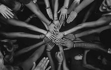
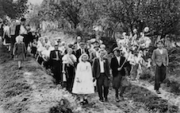

# Our Principles
 
These are the principles and values which shape the culture of our community.
 
## Interdependence

 
We are happy to depend on others, and have them depend on us.
 
We need to share resources to achieve our individual and collective aims. This requires a desire and willingness to compromise and go beyond our individual convenience in the service of the health and workability of the broader community and vision. Interdependence is not a concept but a lived practice – materially & emotionally. For example, we support basic income, and use revenue sharing to facilitate co-ownership.
 
## Surplus making

 
We understand that money is essential to the long-term sustainability and impact of our work at Life Itself.
 
We want to be materially sustainable and independent (over multiple generations). That requires us to make a surplus. We need community members who are interested in and/or supportive of making money and creating profitable enterprises.
 
## Transformation

 
We believe that transformation is possible and that this takes training and applied practice.
 
We engage in ongoing practice and training to develop ourselves, to be well and deal with difficulties that come up. We believe in the possibility of creating a radically better future for individuals and the collective through awakening and the transformation of suffering, and we believe it takes commitment and effort to bring this about.
 
## Coliving

> The jewel of community, the Sangha, is to be held equal to the Buddha and the Dharma. Indeed the whole of holy life is fulfilled through spiritual friendship. 

— The Buddha
 
To nourish and sustain a shared culture we need to spend time together. This can mean living together in community hubs and during the Gathering, or spending time together during work sprints.
 
Coliving brings with it shared practices, fellowship and lived community. It brings direct experience and the practice of interdependence, surplus generation and personal and collective transformation.
 
## Zen & Mindfulness

 
Our ontology and philosophy are grounded in Zen and mindfulness. Zen is not a philosophy or a religion. Zen tries to free the mind from the slavery of words and the constriction of logic. Zen in its essence is the art of seeing into the nature of one's own being, and it points the way from bondage to freedom. Zen is meditation.
 
Key ideas: you are not your thoughts, be here now, non-attachment to views, enlightenment/nirvana (is possible), non-self, interbeing. Primacy of being aka primacy of the right brain.
 
For further reading:
* https://www.bbc.co.uk/religion/religions/buddhism/subdivisions/zen_1.shtml
 
For a useful bibliography:
* https://plato.stanford.edu/entries/japanese-zen/
 
### From Introduction to Blue Cliff Record
 
By Thomas Cleary and J. C. Cleary
 
> The Buddha Gautama, Shakyamuni, whom all Buddhists regard as their ancestor, invented and adapted various teachings and techniques to liberate people; he was likened to a skilled physician giving specific medicines to cure certain diseases. It is said, therefore, that there is no fixed teaching. Yet in spite of outward differences resulting from necessary adaptation to different situations, capacities of understanding and personality configurations, the real Buddha Dharma, the teaching of the enlightened ones, is of one uniform flavor, the flavor of liberation. Just as many streams lead to the ocean, where they merge into the uniform flavor of salt, goes the ancient metaphor, so do the teachings of enlightenment lead to the ocean of enlightenment and merge into the uniform flavor of liberation. When this essence is lost, and people enshrine relics of past method for a sense of personal satisfaction, righteousness, or comfort, then it is said that the medicine has become a disease. It is the practice of Ch’an and all real Buddhism to cut through all ploys of egoism in all its guises, “holy” or “profane,” to break up stultifying material and intellectual idolatry.
>
> A Ch’an master once wrote that the wise enshrine the miraculous bones of the ancients within themselves; that is, they do not regard teachings of ways to enlightenment as an external body of knowledge or information to be possessed as an acquisition or believed or revered as inflexible dogma, but rather apply it as far as possible to themselves and their situations, vivifying the way of enlightenment with their own bodies and lives, not just in their thoughts.
 
## Open-minded rigour

 
"Open-mindedness" means openness to new approaches and new ideas. You question received wisdom and, most of all, yourself ("Am I sure?"). One of the greatest pitfalls as human beings is that we get attached to our views, we identify with them, and we hold on them for dear life. Freedom and power comes from holding our views lightly.
 
At the same time open-mindedness does not mean "anything goes" — astrology and astronomy are *not* equally valid! This open-mindedness is paired with rigour and a respect for expertise. Everything can be questioned — but judiciously. Science and the scientific method are valuable and powerful. The Zen Master knows more than the novice. Furthermore, what an expert knows may not be easily articulated so we also respect intuition and judgment as well as analysis and evidence. Measurement is crucial to performance (as long as it is not confused with the game).
We bring open-minded rigour to our practical, intellectual and spiritual endeavours.
 
:::tip SEE ALSO
For more detail see the primer on [Open-mindedness and Non-attachment to Views](https://lifeitself.us/2016/10/20/open-mindedness-and-non-attachment-to-views/).
:::
 
## Experimentation and Creativity

 
We are open to experiment and change.
 
We don’t have it all worked out. As we explore unknown land we need to embrace uncertainty. We don’t deify innovation and change. We are sensibly conservative – and open-mindedly innovative. We are working things out on an ongoing basis (but we don’t value change for the sake of change).
 
## Integrity
 
:::tip SEE ALSO
For more detail see the dedicated [page on Integrity](/integrity/).
:::
 
An object has integrity when it is whole and complete. Any diminution in its wholeness and completeness results in a diminution in workability. Think of a wheel with missing spokes, it is not whole, complete. It will become out-of-round, work less well and eventually stop working entirely. Likewise, a system has integrity when it is whole and complete.
 
Concretely and specifically, integrity is **Honouring your word**. Honouring your word is defined as:
 
* Doing what you said you would do OR
* Whenever you will *not* be keeping your word you get in action restoring your word with everyone impacted.
 
Why is integrity so valuable? It is the bridge to workability and performance.

## Getting Things Done

We ship, we do, we get stuff done.
 
We’re doers as well as thinkers and meditators. We value hard work, commitment, shipping, and getting sh** done.
 
It takes dedication and effort to be great, to build something big. We want to create extraordinary enterprises and communities – that can not only co-exist with the existing system on its own terms but can surpass it.

We use David Allen's process for [Getting Things Done](/principles/getting-things-done).